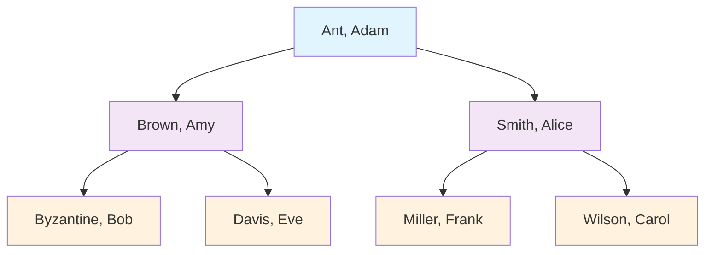

# Game Night Contacts - Binary Search Tree Assignment

Daldus Bumbledore, the owner of Ye Olde 32 Flavors Ice Cream Shoppe, has decided to create a Game Store.

To help get more customers they've also organized a Monthly Game Night! The Game Night community is growing fast and since many members have different volunteer roles like Dungeon Master or Pizza Orderer, they've decided to create a program to help them quickly find each other's contact information.

## Requirements

Your job is to create this Contacts app using a Sorted Binary Tree.  The requirements you have been given are:

- Each member's name is a user's full name, both first and last name.
- The binary tree is sorted by both last name, and first name, in that order of precedence.
- When a new Contact is inserted into the tree it is inserted in the right spot so that the tree remains sorted.

## Example Tree



### Node Class

Another volunteer has already created most of a `Node` class for the tree:

```python
class Node:
    """Node of binary tree"""
    def __init__(self, name, email):
        self.name = name  # Fixed from 'value'
        self.email = email
        self.left = None
        self.right = None

    @property
    def first_name(self):
        """The first name of the contact"""
        # TODO: Implement this
        pass

    @property
    def last_name(self):
        """The last name of the contact"""
        # TODO: Implement this
        pass

    def __str__(self):
        """String representation of the contact"""
        return f"{self.last_name}, {self.first_name} | ({self.email})"
```

### ContactsTree Class

Another pesky volunteer has already specified the `ContactsTree` class:

```python
class ContactsTree:
    """Binary Search Tree for storing contacts sorted by last name"""
    
    def __init__(self):
        self.root = None
    
    def insert(self, name, email):
        """Insert a new contact into the tree"""
        # TODO: Implement this method
        pass
    
    def search(self, name):
        """Search for a contact by name"""
        # TODO: Implement this method
        pass
    
    
    def inorder_traversal(self):
        """Return all contacts in sorted order (by last name)"""
        # TODO: Implement this method
        pass
```